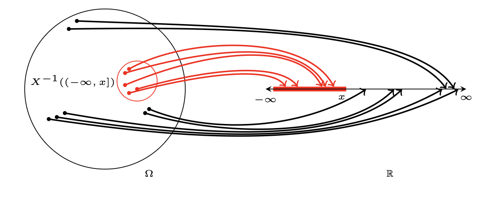

# Chapter 2 -  Random Variable
## Formal Definition of the Random Variable

A random variable, $X$, is a function from the sample space $\Omega$ to the real line $\mathbb{R}$ which associates to each outcome $\omega$ a real value $X(\omega)$, such that for any subset $R \subset \mathbb{R}$, obtained by taking unions, intersections, and complements of a discrete number (finite or infinite) of open or closed intervals in $\mathbb{R}$, the set $X^{-1}(R) = \Set{\omega : X(\omega) \in R}$ is an event in $F$; $F$ is  the set of all events and $X^{-1}(R)$ maps the subset $R$ back to the outcomes in the sample space. 
 
 
We use $P(X \in R)$ to denote the probability of this event, that is, 

$P(X \in R) = P(X^{-1}(R)) = P(\Set{\omega : X(\omega) \in R})$
 
This shows that the probability of the random variable and $\omega$ are associated.
 
 

For any real number $x$,
 
$X^{-1}((-\infty, x]) = \Set{\omega : X(\omega) \leq x}$ 
 
is an event with probability $P(X \leq x)$. 

Note that, $R$ is the interval $(-\infty, x]$. This means that we are summing the probability of every outcomes in the interval to obtain the probability that the event representing that interval occurs.
 
 
This probability, denoted by $F_X(x)$, is the *cumulative distribution function* (CDF) of $X$.
 

## Properties of the CDF
1) $F_X(-\infty)$ = 0, $F_X(\infty)$ = 1.
2) $F_X(x)$ is nondecreasing.
3) $F_X(x)$ is right continuous. That is, $\lim_{x \to x_0^{+}}F_X(x) = F_X(x_0)$
4) $P(X = x_0) = F_X(x_0) - F_X(x_0^{-})$. 
Thus, $X$ takes the vaue $x_0$ with nonzero probability iff $F_X(x)$ is discontinuous at $x_0$

## Discrete Random Variable
The CDF of a discrete random variable is a staircase function with discontinuities. 
The probability that $X$ assumes the value $x_0$ is  
$p_X(x_0) = P(X = x_0) = P(\Set{\omega : X(\omega) = x_0}) = F_X(x_0) - F_X(x_0^{-})$ 
This is the *probability mass function* (PMF) of the random variable $X$.

## Continuous Random Variables
A random variable $X$ is continuous if there is a function $f_X(x)$ such that for all $x_0 \in \mathbb{R}$, 
$F_X(x_0)$ = $\int_{-\infty}^{x_0} f_X(x) \, dx$  
The function $f_X(x)$ is the *probability density function* (PDF) of the random variable $X$.  
Since $F_X(\infty) = 1$, we have $\int_{-\infty}^{\infty} f_X(x) dx = 1$ 
If $F_X(x)$ is differentiable, then $f_X(x)$ is its derivative.

## Conditional CDF
The *conditional CDF* of a random variable $X$ given and event $E$, with $P(E) > 0$, is given by 
$F_X(x|E) = P(X \leq x|E) = \frac{P(X \leq x \cap E)}{P(E)}$   
The *conditional PDF*, $f_X(x|E)$, of $X$ given $E$ is  
$F_X(x|E) = \int_{-\infty}^{x} f_X(x|E)dx$  
## Derived Random Variable
Let $X$ be a random variable and $Y = g(X)$, for some function $g:\mathbb{R} \to \mathbb{R}$. 
Then, $Y$ is a random variable. 
### CDF
Let $y$ be a real number and $S_ \leq y = \Set{x: g(x) \leq y}$. Then, $F_Y(y) = P(Y \leq y) = P(X \in S_\leq y)$  
### PMF
If $X$ is discrete, then $ Y = g(X)$ is discrete. 
Let $S_=y = \Set{x: g(x) = y}$. We have $p_Y(y) = P(X \in S_=y)$

### Go from PDF of $X$ to $Y$
Find the CDF of $Y$ from $X$ and differentiate it.

## Expected Value of a Random Variable
The *expected value*, $E[X]$, is defined as  
### Discrete $X$ with PMF
$m_X = E[X] = \sum_{x}x\thinspace p_X(x)$
### Continuous $X$ with PDF 
$E[X] = \int_{-\infty}^{\infty} g(x) \thinspace f_X(x)dx$
### Derived Y with PMF
$E[Y] = \sum_{x} g(x)p_X(x)$

## Variance, Moments, Moemnet Generating Function, and Characteristic Function of a Random Variable
### Moment
The $l^{th}$ moment of the random variable $X$, where $l$ is a positive integer, is given by $E[X^{l}]$. The first moment is the expectation.
### Variance
The *variance* of $X$ is $Var[X] = E[(X - m_X)^{2}] = E[X^{2}] - m^{2}_X$
### Moment Generating Function
The *moment generating function* of $X$ is $M_X(s) = E[e^{sX}]$ where s is in the region of nvergence (ROC) of the function. 
* Property: $E[X^{l}] = \frac{d^{l}}{ds^{l}} M_X(s)\large |_{s = 0}$

### Characteristic Function
The *characteristic function* of $X$ is obtained by evaluating $M_X(s)$ on the imaginary axis. That is, $\Phi_X(\omega) = E[e^{j\omega X}]$, where $j = \sqrt{-1}$. Since $|e^{j\omega X}| = 1$, the characteristic function always exists. 
* Discrete Fourier Transform Property of $X$: $\Phi_X(\omega) = \sum_x p_X(x)\space e^{j\omega x}$ and $p_X(\omega) = \frac{1}{2 \pi}{\large \int_{-\pi}^{\pi}}\Phi_X(\omega)e^{-j\omega x}d\omega$.
* Continuous Fourier Transform Property of $X$: $\Phi_X(\omega) = {\large \int_{-\infty}^{\infty}f_X(x)e^{j\omega x}dx}$ and $f_X(x) = \frac{1}{2 \pi}\int_{-\infty}^{\infty}\Phi_X(\omega)e^{-j\omega x}d\omega$.
* Important Properties
    1) $\Phi_X(\omega)$ is bounded. $|\Phi_X(\omega)| \leq \Phi(0) = 1$.
    2) $\Phi_X^{*}(\omega) = \Phi_X(-\omega)$.
    3) $E[X^{l}] = \frac{1}{j^{l}}\Phi_X^{(l)}(0)$, provided that the derivatives exist.
## Common Discrete Random Variables
### Bernoulli Random Variable
Denoted by Bernoulli($p$), is a discrete random variable which assumes two values, 0, and 1, with PMF: $p_X(0) = 1 - p$ and $p_X(1) = p$. We have
* $E[X] = p$
* $K_X = p(1 - p)$
* $M_X(s) = (1 - p) + pe^{s}$
* $\phi_X(\omega) = (1 - p) + pe^{j\omega}$.
### Binomial Random Variable
Denoted by Binomial($n, p$), is a discrete random variable which counts the number of successes in n independent trials where the probability of each success is $p$. It assumes the values $0, 1, 2, ..., n $ with PMF given by  
$p_X(k) = {\binom {n}{k}}p^{k}(1 - p)^{n - k}$. 
We have
* $E[X] = np$
* $K_X = np(1-p)$
* $M_X(s) = ((1 - p) + pe^{s})^{n}$
* $\phi_X(\omega) = ((1-p) + pe^{j\omega})^{n}$
### Poisson Random Variable
Denoted by Poisson($\lambda$), $\lambda > 0$, os a disrete random variable which assumes the values $0, 1, 2,...$ with PMF given by $p_X(k) = e^{-\lambda}\frac {\lambda^{k}}{k!}$. We have
* $E[X] = \lambda$
* $K_X = \lambda$
* $M_X(s) = e^{\lambda(e^{s} - 1)}$
* $\phi_X(\omega) = e^{\lambda (e^{j\omega} - 1)}$
* Poisson Random Variable could be used as an approxiation for Binomial Random Variable with $p = \frac{\lambda}{n}$ as $ n \to \infty$ 
### Geometric Random Variable
Denoted by Geometric($p$), $0 < p < 1$, is a discrete random variable which counts the number of trials required for the first success in independent trials, where the probability of each success is $p$. It assumes the values $1, 2, 3,...$ with the PMF given by $p_X(k) = (1 - p)^{k-1}p$.
* $E[X] = \frac{1}{p}$
* $K_X = \frac{1-p}{p^{2}}$
* $M_X(s) = \frac{p}{e^{-s}-(1-p)}$, where real part of $s < ln(1-p)$.
* $\phi_X(\omega) = \frac{p}{e^{-j\omega} - (1 - p)}$.
## Common Continuous Random Variables
### Uniform Random Variable
A uniform random variable, $X$, over the interval $[a, b]$, denoted by Uniform(a, b), where a < b, has PDF and CDF
$
f_X(x) = 
\begin{cases}
    \frac{1}{b - a} & \text{for} \space a \leq x \leq b\\
    0 & \text{otherwise.}
\end{cases}
$

$
F_X(x) = 
\begin{cases}
    0 & x < a\\
    \frac{x - a}{b - a} & a \leq x \leq b\\
    1 & x > b    
\end{cases}
$
* $E[X] = \int_{a}^{b} \frac{x}{b-a}dx = \frac{1}{2}(b + a)$
### Exponential Random Variable
An exponential random variable, $X$, with parameter $\lambda > 0$, denoted by Exponential ($\lambda$), has PDF and CDF

$
f_X(x) = 
\begin{cases}
    0 & x < 0\\
    \lambda e^{-\lambda x} & x \geq 0\\
\end{cases}
$

$
F_X(x) = 
\begin{cases}
    0 & x < 0\\
    1- e^{-\lambda x} & x \geq 0\\
\end{cases}
$
* $E[X] = \frac{1}{\lambda}$
* $E[X^{2}] = \frac{1}{\lambda^{2}}$
* The exponential random variable is memoryless, which means $P(X > a + b) = P(X > a) = P(X > a)P(X > b)$.

