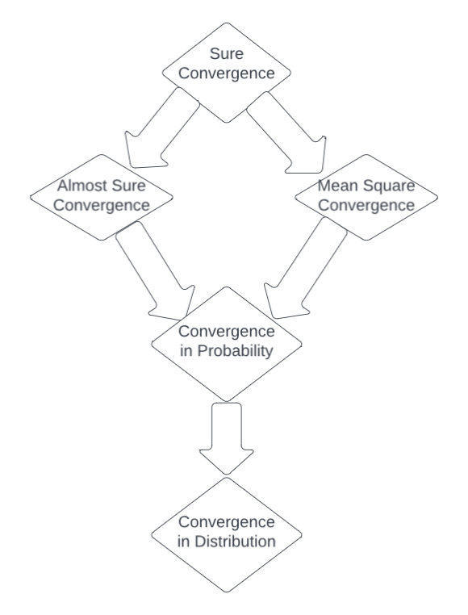

# Chapter 3 - Bounds, Convergence, and Limit Theorem

## Bounds on Probability
### Markov's Inequality
If $X$ is a random variable that takes only nonnegative values, then for any $z>0$, $$P(X \geq z)\leq \frac{E[X]}{z} $$

### Chebyshev's Inequality
If $X$ is a random variable with mean $m_X$ and variance $K_X$, then for any $z > 0$,
$$P(|X - m_X| \geq z) \leq \frac{K_X}{z^{2}}$$

### Jensen's Inequality 
Let $g:\mathbb{R} \to \mathbb{R}$ be a convex function and $X$ be a random variable, then $g(E[X])\leq E[g(X)]$.

A function $g:\mathbb{R} \to \mathbb{R}$ is convex if for all $\alpha, 0 \leq \alpha \leq 1$, and all real $x_1$ and $x_2$,
$$g(\alpha x_1 + (1 - \alpha)x_2) \leq \alpha g(x_1) + (1 - \alpha)g(x_2)$$
Geometrically, this means g lies above any of its tangents.

### Cauchy-Schwartz Inequality
Let $X$ and $Y$ be random variables with finite variances. Then, 
$$|E[XY]| \leq \sqrt{E[X^{2}]E[Y^{2}]}$$

## Convergence of Random Variables
* Sure Convergence implies all other types of convergence.
* Almost Sure Convergence and mean square convergence implies convergence in probability.
* Convergence in probability implies convergence in distribution.

### Surely Convergence
The sequence $X_1, X_2,\dots$ converges to $X$ **surely**, denoted by $X_n \xrightarrow{s} X$, if for every $\omega \in \Omega$,
$$X_n(\omega) \to X(\omega)$$

### Almost Surely Convergence
The sequence $X_1, X_2,\dots$ converges to $X$ **almost surely** or **with probability 1**, denoted by $X_n \xrightarrow{a.s.}X$, if
$$P(\Set{\omega : X_n(\omega) \to X(\omega)}) = 1$$
Note that this is less stringent than sure convergence because we only ask for outcomes contributing to the probability to converge.

### Convergence in Mean Square
The sequence $X_1, X_2, \dots$ converges to $X$ **in the mean square sense**, denoted by $X_n \xrightarrow{m.s.}X$, if
$$\lim_{n \to \infty}E[(X_n-X)^{2}] = 0$$

### Convergence in Probability
The sequence $X_1, X_2, \dots$ converges to $X$ in **probability**, denoted by $X_n \xrightarrow{p}X$, if for every $\epsilon > 0$
$$\lim_{n\to \infty} P(|X_n - X| > \epsilon) = 0$$

### Convergence in Distribution
The sequence $X_1, X_2, \dots$ converges to $X$ in **distribution** or **weakly**, denoted by $X_n \xrightarrow{d}X$, if for every $x$ for which $F_X(x)$ is continuous,
$$\lim_{n \to \infty}F_{X_n}(x) = F_X(x)$$

## Laws of Large Numbers
Let $X_1, X_2, \dots$ be a sequence of independent and identically distributed random variables, each with mean $m$. Let $\hat{X}_n = \frac{1}{n} (X_1 + X_2 + \dots + X_n)$. Then , $\hat{X}_n$ is a random variable called the **sampled mean**.

**Weak Law of Large Numbers**: $\hat{X}_n \xrightarrow{p} m$

**Strong Law of Large Numbers**: $\hat{X}_n \xrightarrow{a.s.} m$ provided that $E[|X_1|] < \infty$

## Central Limit Theorem
Let $X_1, X_2, \dots$ be a sequence of independent and identically distributed random variables each having mean $m$ and finite variance $K$. For $n = 1, 2, \dots,$ let
$$Y_n = \frac{\sum_{k = 1}^{n}(X_k - m)}{\sqrt{nK}} = \frac{S_n - nm}{\sqrt{nK}} = \sqrt{\frac{n}{K}}(\hat{X}_n - m)$$
where $S_n = X_1 + X_2 + \dots + X_n$ and $\hat{X}_n$ is the sampled mean.

The **Central Limit Theorem** states that $Y_n \xrightarrow{d} Y$ where $Y$ is Gaussian(0, 1). For any y,
$$P(Y_n \leq y) \to \frac{1}{\sqrt{2 \pi}}\int_{-\infty}^{y}e^{-\frac{x^{2}}{2}}dx = \phi(y)$$

## Large Deviations and Rate Function
The Central Limit Theorem gives a poor estimation of $P(S_n > nz)$ when $z$ differs greatly from the $m_X$, where $S_n$ is the sum of $n$ independently and identically distributed random variables.

### Chernoff Bound
If $X$ is a random variable with moment generating function $M_X(s)$, then for every real $s \geq 0$
$$P(X \geq z) \leq \frac{M_X(s)}{e^{sz}}$$

### Hoeffding's Inequality
Let $X_1, X_2, ..., X_n$ be independent random variables such that $a_i \leq X_i \leq b_i$ with probability 1 for each $i = 1, 2, \dots, n$. Let $S_n = \sum_{i = 1}^{n} X_i$. Then, for any $z > 0$,
$$P(S_n - E[S_n] \geq nz) \leq e^{\frac{-2n^{2}z^{2}}{\sum_{i = 1}^{n}(a_i - b_i)^2}}$$
$$P(S_n - E[S_n] \leq -nz) \leq e^{\frac{-2n^{2}z^{2}}{\sum_{i = 1}^{n}(a_i - b_i)^2}}$$
$$P(|S_n - E[S_n]| \geq nz) \leq 2e^{\frac{-2n^{2}z^{2}}{\sum_{i = 1}^{n}(a_i - b_i)^2}}$$
$$P(|\hat{X_n} - E[\hat{X_n}]| \geq z) \leq 2e^{\frac{-2n^{2}z^{2}}{\sum_{i = 1}^{n}(a_i - b_i)^2}}$$