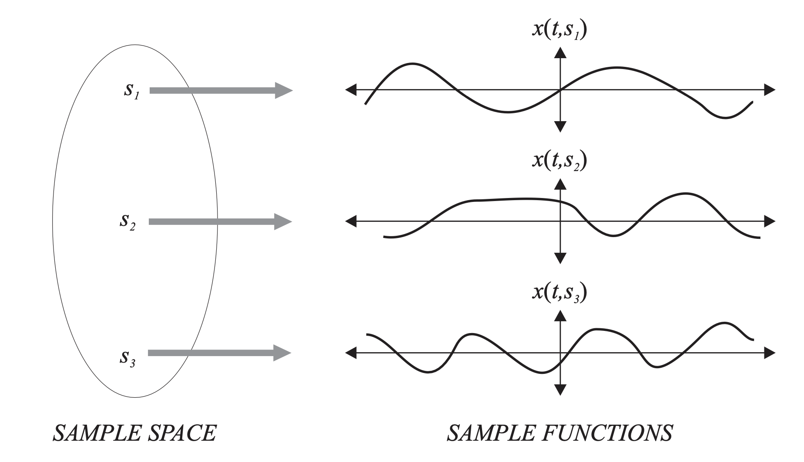

# Stochastic Processes

Stochastic means random, and process means function of time.

A **stochastic process** $X(t)$ consists of an experiment with a probability measure $P[.]$ defined on a sample space $S$ and a function that assigns a time function $x(t, s)$ to each outcome $s$ in the sample space of the experiment.

Just as a random variable assigns a real number to each outcome, a stochastic process assigns a sample function to each outcome.

A sample function $x(t, s)$ is the time function associated with outcome $s$ of an experiment. A sample function corresponds to an outcome of a stochastic process experiment. It's one of the possible time functions that can result from the experiment. The **ensemble** of a stochastic process is the set of all possible time functions that can result from an experiment.

Given the process has different random variables a different time, it's a two-dimensional model with two kinds of averages.
With $t$ fixed at $t = t_0$, $X(t_0)$ is a random variable, and we could find its expected value and variance. This is the **ensemble averages**. There is also a **time average** of the sample function.

To characterize a random process, we could find the joint PDF of its random variables at different time, $f_{X(t_1), \dots, X(t_k)}(x_1,\dots,x_k)$ for all $k$

## Bernoulli Process
A Bernoulli (p) process $X_n$ is an independent and identically distributed random sequence in which each $X_n$ is a Bernoulli (p) random variable.
 
For a single sample $X_i$, the Bernoulli PMF is:
$$ P_{X_i}(x_i) = 
\begin{cases}
p^{x_i}(1-p)^{1-x_i} & x_i \in \Set{0, 1} \\
0 & otherwise.
\end{cases}
$$

The joint PMF of the process is
$$P_\bold{X}(\bold{x}) = 
\begin{cases}
\prod_{i = 1}^{n}p^{x_i}(1-p)^{1-x_i} = p^{k}(1-p)^{n-k} & x_i \in \Set{0, 1}, i = 1, \dots, n, \\
0 & otherwise.
\end{cases}
$$
where $k = x_1 + \dots + x_n$ and $\bold{X} = [X_1, \dots, X_n]^T$

## The Expected Value of a Process
The expected value of a stochastic process $X(t)$ is the deterministic function
$$\mu_X(t) = E[X(t)]$$

## Autocovariance
The autocovariance function of the stochastic process $X(t)$ is 
$$C_X(t, \tau) - Cov[X(t), X(t + \tau)]$$

The autocovariance function of the random sequence $X_n$ is
$$C_X[m, k] = Cov[X_m, X_{m+k}]$$

## Autocorrelation Function
The autocorrelation function of the stochastic process $X(t)$ is
$$R_X(t, \tau)  = E[X(t)X(t + \tau)]$$

The autocorrelation function of the random sequence $X_n$ is
$$R_X[m, k] = E[X_m, X_{m + k}]$$

The auto correlation and autocovariance functions of a process $X(t)$ satisfy 
$$C_X(t, \tau) = R_X(t, \tau) - \mu_X(t)\mu_X(t + \tau)$$

The auto correlation and autocovariance functions of a random sequence $X_n$ satisfy 
$$C_X[n, k] = R_X[n, k] - \mu_X(n)\mu_X(n + k)$$

## Cross-correlation and Cross-covariance
Let $X(t)$ and $Y(t)$ be stochastic processes. Their cross-correlation function is
$$R_{XY}(t_1, t_2) = E[X(t_1)Y(t_2)]$$

and their cross-covariance function is
$$K_{XY}(t_1, t_2) = R_{XY}(t_1, t_2) - m_X(t_1)m_Y(t_2)$$

## Strict Sense Stationary Process (SSS)
For stationary process, we observe the same random variable at all time instants. The statiscal properties of the process fo not change with time.

A stochastic process $X(t)$ is stationary if and only if for all sets of time instants $t_1, \dots, t_m$, and any time difference $\tau$, 
$$f_{X(t_1), \dots, X(t_m)}(x_1, \dots, x_m) = f_{X(t_1 + \tau), \dots,X(t_m + \tau)}(x_1, \dots, x_m) $$

For a stationary process $X(t)$,

(a) $\mu_X(t) = \mu_X$

(b) $R_X(t, \tau) = R_X(0, \tau) = R_X(\tau)$

(c) $C_X(t, \tau) = R_X(\tau)-\mu_X^{2} = C_X(\tau)$

## Wide Sense Stationary Process (WSS)
$X(t)$ is a wide sense stationary process if and only if for all t
$$ E[X(t)] = \mu_X, \space and \space \space R_X(t, \tau) = R_X(0, \tau) = R_X(\tau)$$

The autocorrelation function of a Wide Sense Stationary Process $X(t)$, has the following properties:

(a) $R_X(0) \geq 0$

(b) $R_X(\tau) = R_X(-\tau)$

(c) $R_X(0) \geq |R_X(\tau)|$

## Jointly WSS
We say that the stochastic processes $X(t)$ and $Y(t)$ are jointly WSS if both $X(t)$ and $Y(t)$ are WSS
and $R_{XY}(t_1, t_2)$ depends only on $t_1 - t_2$